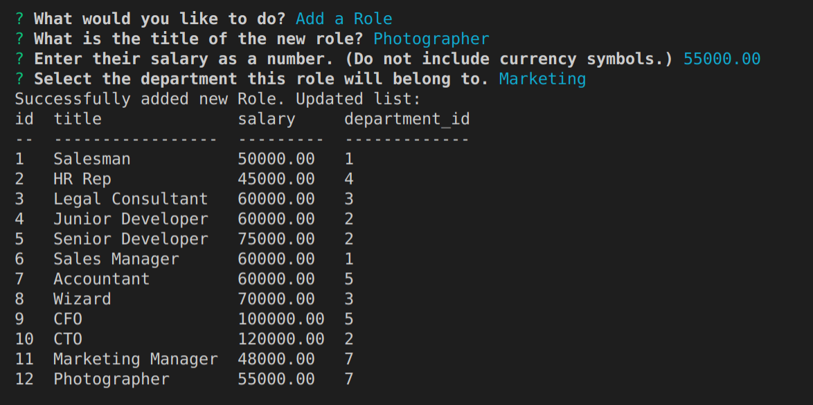

# employee-tracker

## Description 
A command-line program for viewing and updating employee information in a company database. 



## Installation
After cloning, run: 
```
npm i
```
Confirm you have the following dependencies installed:

[console.table](https://www.npmjs.com/package/console.table) <br>
[dotenv](https://www.npmjs.com/package/dotenv) <br>
[Inquirer](https://www.npmjs.com/package/inquirer) <br>
[mysql2](https://www.npmjs.com/package/mysql2) 

## Demo
[Video Walkthrough](https://drive.google.com/file/d/1eAwkYZSkUp4pVdx6Wbv79uD_Mg4Y1PL6/view)